# Home SOC & Active Directory Lab

I built a small corporate network in Microsoft Azure to practice IT administration and security monitoring. It has a Windows Server domain controller running Active Directory, a domain-joined Windows 11 workstation, and an Ubuntu server running Splunk as a SIEM. I forwarded Windows security logs into Splunk, ran a simulated brute-force attack, and built a search that detects it. That same search also caught real brute-force attempts coming from the internet against the lab.

## Lab Setup

| Machine | OS | Role |
|---|---|---|
| DC01 | Windows Server 2022 Datacenter | Domain controller for `soclab.local` (AD DS + DNS), runs the Splunk Universal Forwarder |
| CLIENT01 | Windows 11 Pro | Employee workstation joined to the domain |
| SPLUNK01 | Ubuntu Server 24.04 LTS | Splunk Enterprise, receiving logs on TCP 9997 |

All three VMs run in one Azure virtual network so they can talk over private IPs. I connect from my Mac with Microsoft Remote Desktop (Windows), SSH (Ubuntu), and a browser for the Splunk web interface on port 8000.

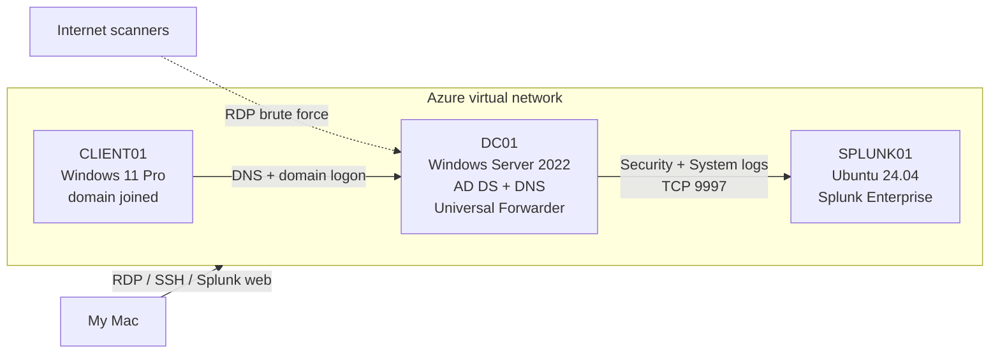

**Tools:** Microsoft Azure, Windows Server 2022, Active Directory, DNS, Group Policy, Windows 11, Ubuntu Linux, Splunk Enterprise, Splunk Universal Forwarder, PowerShell, Microsoft Remote Desktop

## 1. Active Directory

I promoted DC01 to a domain controller for a new forest called `soclab.local`:

```powershell
Install-WindowsFeature AD-Domain-Services -IncludeManagementTools
Install-ADDSForest -DomainName "soclab.local" -InstallDNS
```

Then I set it up like a small company:

- Created **IT**, **Sales**, and **HR** organizational units
- Created 5 domain users across those OUs
- Created an **IT-Admins** security group and added users to it
- Created a Group Policy that shows a logon banner warning that only authorized users are allowed

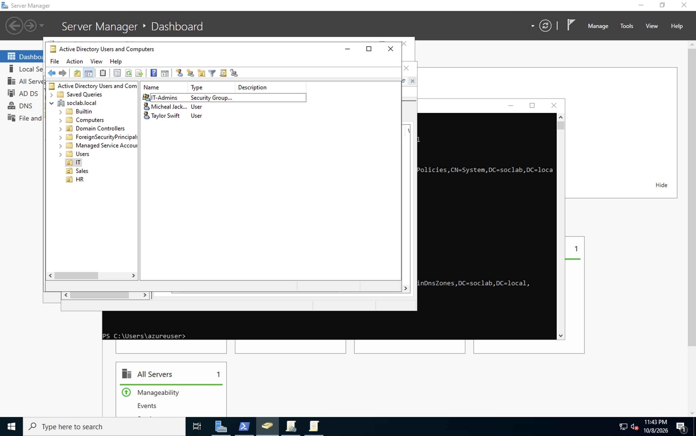

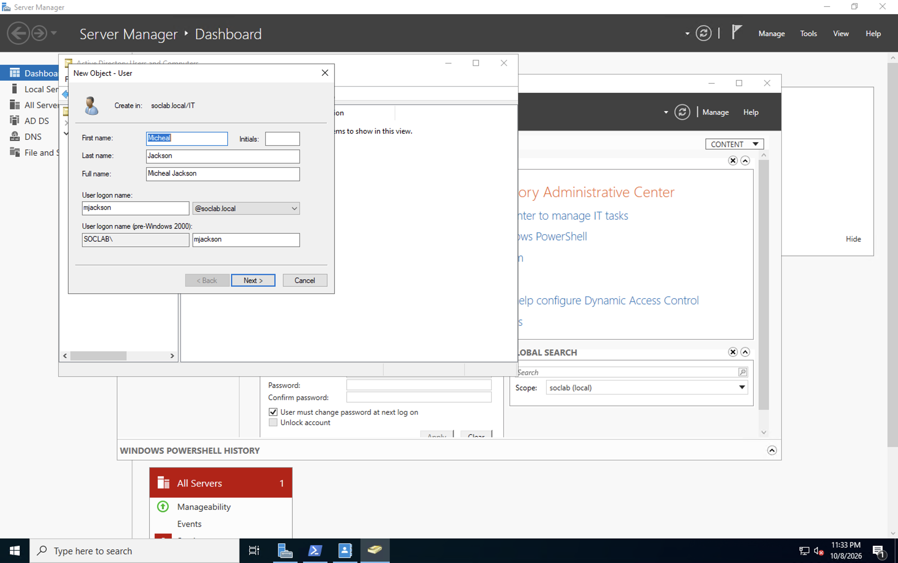

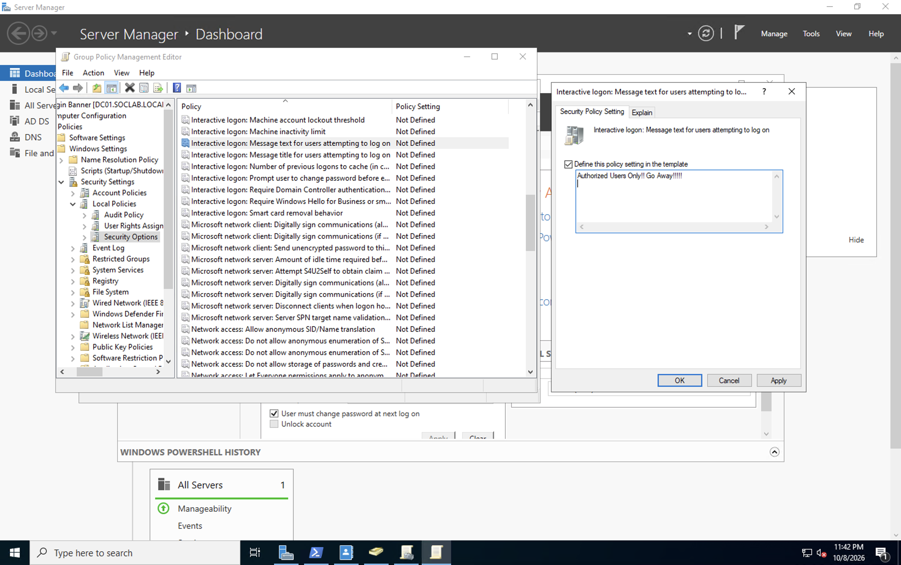

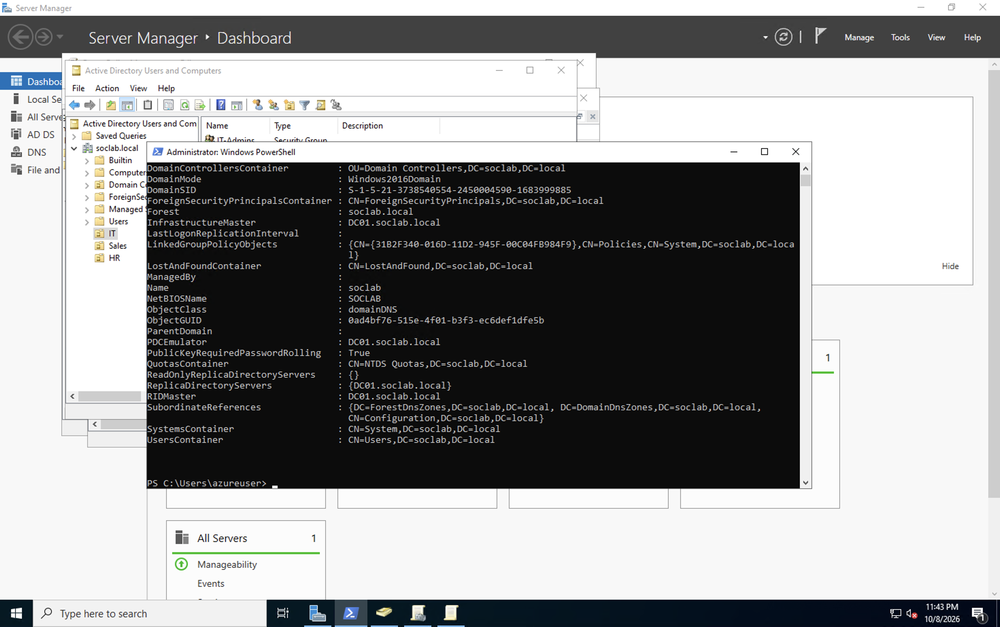

## 2. Joining a Windows 11 Client to the Domain

I pointed CLIENT01's DNS at DC01's private IP so it could find the domain, then joined it to `soclab.local`. After a restart I logged in as one of the domain users I created, which confirmed AD, DNS, and authentication were all working.

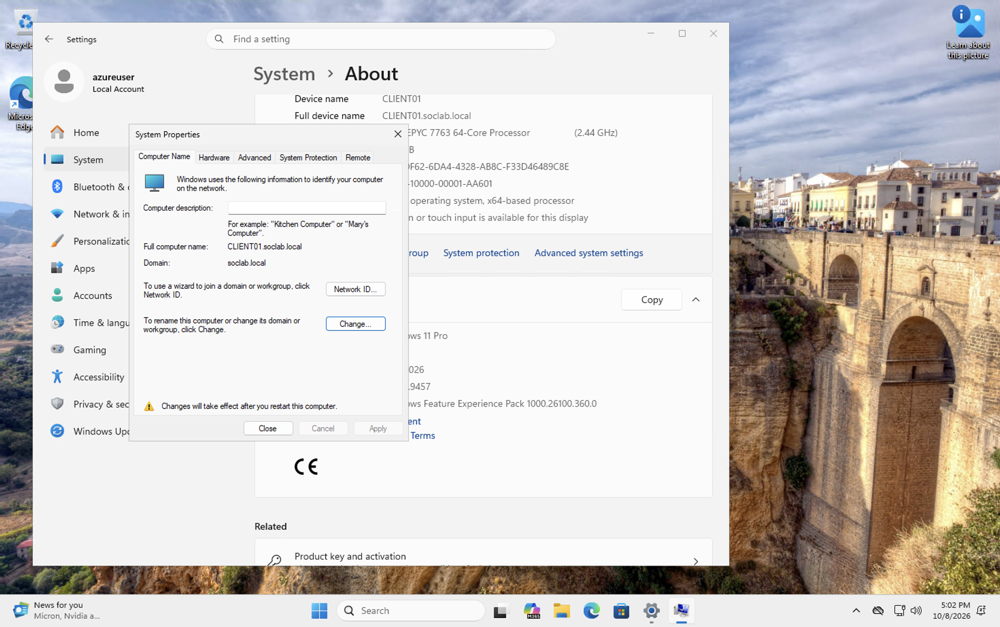


## 3. Splunk SIEM

On SPLUNK01 I installed Splunk Enterprise from the `.deb` package, ran it as a non-root user, and opened port 9997 to receive logs:

```bash
sudo dpkg -i splunk-*-linux-amd64.deb
sudo chown -R azureuser:azureuser /opt/splunk
/opt/splunk/bin/splunk start --accept-license
/opt/splunk/bin/splunk enable listen 9997
```

I also added Azure network security group rules for TCP 8000 (Splunk web) and TCP 9997 (log receiving).

## 4. Forwarding Windows Logs

On DC01 I installed the Splunk Universal Forwarder, pointed it at SPLUNK01 on port 9997, and selected the **Security** and **System** event logs.

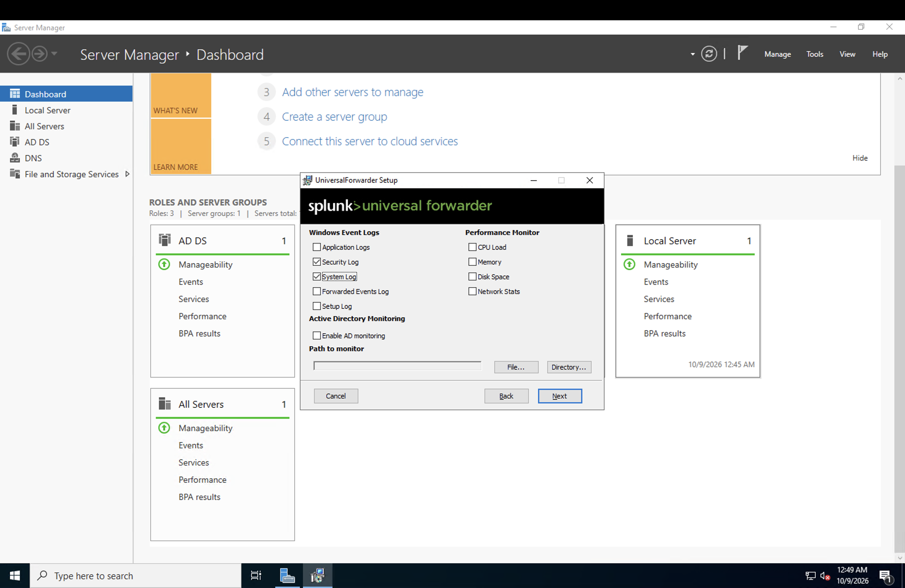

Within the first day Splunk had indexed over 11,000 Windows security events from DC01:

```spl
index=* source="WinEventLog:Security"
```

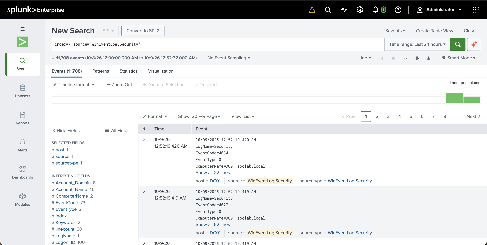

## 5. Attack and Detection

To simulate a brute-force attack, I ran a PowerShell loop on DC01 that tried to start a process as the domain user `mjackson` with a different wrong password each time:

```powershell
1..15 | ForEach-Object {
  $u = "soclab\mjackson"
  $p = ConvertTo-SecureString "WrongPass$_!" -AsPlainText -Force
  $cred = New-Object System.Management.Automation.PSCredential($u, $p)
  Start-Process cmd.exe -Credential $cred -ErrorAction SilentlyContinue
}
```

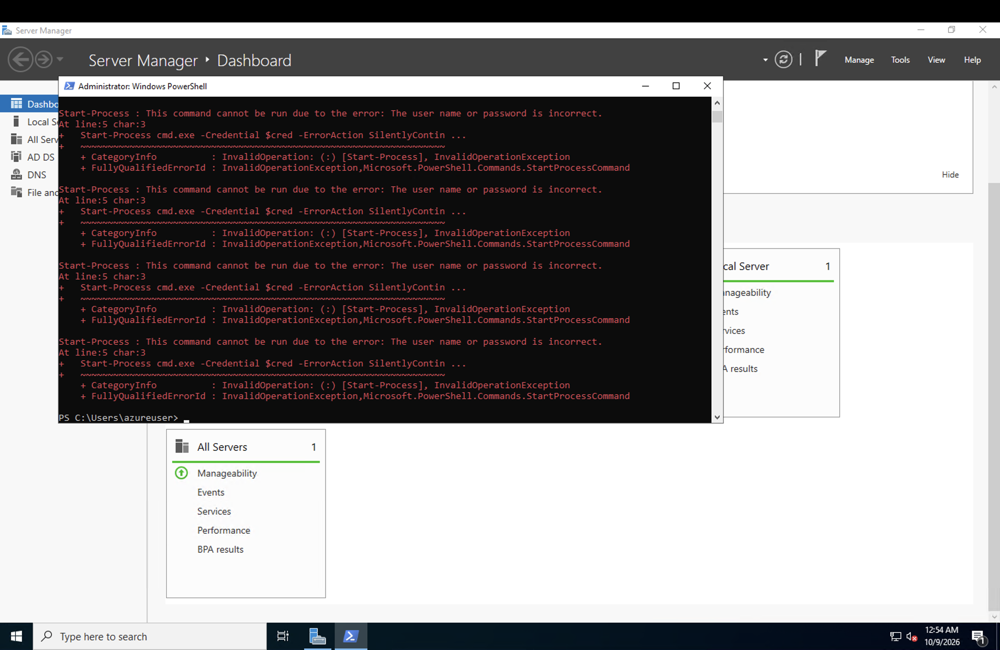

Every failed logon creates Windows **Event ID 4625**. I searched for those events in Splunk:

```spl
index=* source="WinEventLog:Security" EventCode=4625
```

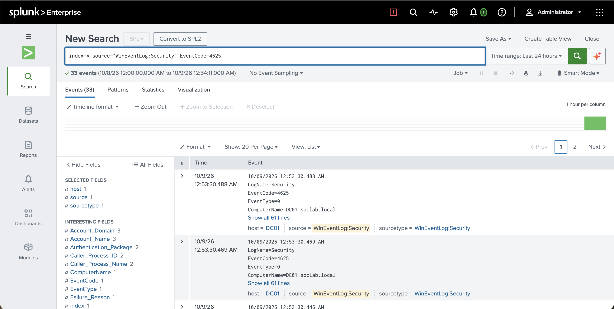

Then I grouped them by account and source address, which is how an analyst would summarize a brute-force pattern:

```spl
index=* source="WinEventLog:Security" EventCode=4625
| stats count by Account_Name, Source_Network_Address
```

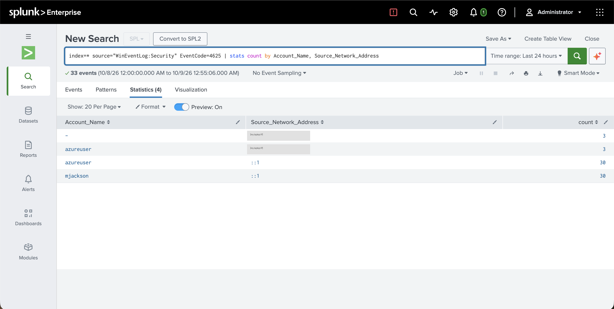

| Account_Name | Source_Network_Address | Count | What it is |
|---|---|---|---|
| mjackson | ::1 | 30 | My simulated attack (target account) |
| azureuser | ::1 | 30 | My simulated attack (the account that ran the script) |
| azureuser | 45.3.89.14 | 3 | **Real attacker on the internet** |
| - | 45.3.89.14 | 3 | Same real attacker |

Event 4625 has two account name fields: the subject (who made the request) and the target (the account being logged into). That's why each attempt shows up under two names in the table.

### The real attack

The rows from `45.3.89.14` were not me. Within hours of DC01 getting a public IP with RDP open, an outside host was already trying to log in as `azureuser`, which is the default admin name Azure suggests. My detection caught it the same way it caught my simulation. This was the most useful lesson of the whole project: anything exposed to the internet gets scanned and attacked almost right away.

## Problems I Ran Into

These took the most time and taught me the most:

- **Azure for Students region policy.** My subscription only allowed five regions, so my first deployments failed with `RequestDisallowedByAzure`. I found the allowed list and moved everything to one allowed region.
- **vCPU quota.** The student subscription caps regional vCPUs at 4, so I could only run two 2-vCPU VMs at once. I stopped CLIENT01 while working on Splunk.
- **Public IP quota.** The subscription allows only 3 public IPs. A failed deployment had left an orphaned IP, which I found and deleted.
- **Client couldn't find the domain.** Joining CLIENT01 failed until DC01 was actually running and CLIENT01's DNS pointed at DC01's private IP.
- **Domain users can't RDP by default.** Logging in remotely as a standard domain user gave error `0x2407`. Regular users have to be added to the machine's Remote Desktop Users group.
- **Linux login failures.** SSH kept rejecting me because the VM's admin account was `azureuser`, not the name I thought I had set. I used Azure Run Command to find the real username and reset the password.
- **Splunk refused to run as root.** Splunk 10 won't start as root by default, so I gave a normal user ownership of `/opt/splunk` and ran it as that user.

## What I Learned

- How Active Directory, DNS, and Group Policy fit together in a Windows domain
- How a SIEM collects logs from endpoints with a forwarder
- How to find and summarize failed logons with Splunk's search language
- That cloud resources exposed to the internet get attacked fast, and why monitoring matters
- How to troubleshoot cloud quotas, network settings, and login problems

## Next Steps

- Restrict RDP and SSH to my own IP address (or use Azure Bastion) instead of leaving them open to the internet
- Save the 4625 search as a scheduled Splunk alert that fires when one source has more than 5 failures in 5 minutes
- Install the forwarder on CLIENT01 so workstation logs are collected too
- Add Sysmon for more detailed process and network logging
- Run attacks from a Kali Linux VM and capture the traffic in Wireshark
